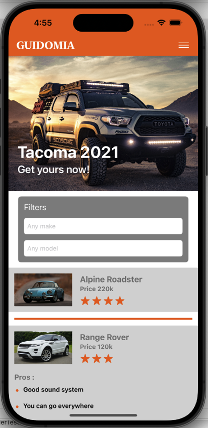
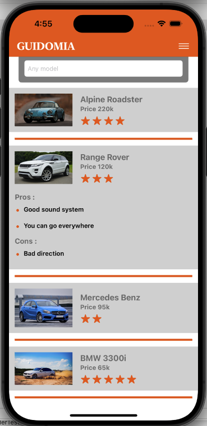

Guidomia
===========

 

## Introduction

Guidomia is a SwiftUI iOS app developed for the take home exam for a Canadian company. Users can browse cars with images from a sample json data provided by the company.

## Build Tools & Versions Used

I developed Guidomia using Xcode 15.3 and iOS 17.4.

## Discussion

Aside from meeting the requirements of the coding challenge, I focused on using techniques including dependency injection, protocol oriented programming, decoupling of dependencies that facilitate unit testing. I have come to value unit testing because, as Jon Reid [observed](https://qualitycoding.org), a "robust suite of unit tests acts as a safety harness, giving you [courage](https://www.theverge.com/2016/9/7/12838024/apple-iphone-7-plus-headphone-jack-removal-courage) to make bold changes." In nuts-and-bolts terms, dependency injection makes objects testable by isolating dependencies and side effects. Guidomia's unit-test coverage is above 90%. I have also included UI testing. 

Guidomia demonstrates Swift concurrency features [concurrency](https://github.com/apple/swift-evolution/blob/main/proposals/0296-async-await.md). I made use of MainActor, async, and await syntax. 

As outlined in the code test instructions, the app fetches data from the file, during first load, then saves this to a local database. On succeeding launches, the app will then fetch from the local database. For this, I made use of CoreData. This is a powerful tool that does not make use of third party libraries such as that used by Realm. During testing of CoreData, I injected a persistent container with in-memory cache so it is faster during unit testing.

The file loader class as well as the coredata loader class belongs to the same fetcher protocol. This is significant as, in the future, developers can easily add a different data loader that implements the same protocol, such as a class that fetches from a remote database. All the other data objects will remain the same and will be unaffected by the changes. The data orchestrator class contains the logic behind data fetching. If there is a change in the data flow, only this class will be affected by the changes. An example of such a change could be: fetch from the online database then save to the local database, but fetch from the local database if there is no Internet connection.

The data related services are in their own classes. The business logic is controlled from the viewmodel. The view structs only contain visual elements. There is clear separation of concerns.

Guidomia supports iPhone, iPad, landscape orientation, portrait orientation, all optimized in Light Mode but working also, though not optimized yet, for Dark Mode.  Some work needs to be done to improve the app in Dark Mode. I developed Guidomia primarily for iPhone. iPad would benefit from, for example, higher information density in car rows. Landscape orientation on iPhone would be more idiomatic if it used `UISplitViewController` like [Mail](https://apps.apple.com/us/app/mail/id1108187098) does. Due to time constraints that are characteristic of coding exams, Guidomia may imperfectly support VoiceOver, but accessibility [is important](https://github.com/vermont42/Conjuguer/commit/7d93d1459a085bb498cf9a7e4f3680f2d7e08839) to me.

In Guidomia, I relied on the colors provided from the instructions. However, if I may, I would like to suggest the use of system-provided colors (such .systemOrange) as these have been prepared by Apple to automatically support (auto-adjusts) for Dark and Light Mode.

The app fits perfectly the iPhone 15 Pro form factor. If some car info ended up not fitting in a row, tweaks would be in order. Dynamic Type, which I did not test due to time constraints, might also necessitate tweaks.

The coding exam has no requirement for internationalization or localization but I did wrap user-facing `String`s in `NSLocalizedString()`. I am, however, comfortable with that API.

## Warning

If you run Guidomia in the simulator, as I did during development, you may see the following warning:

`[plugin] AddInstanceForFactory: No factory registered for id <CFUUID 0x6000001ad4a0> F8BB1C28-BAE8-11D6-9C31-00039315CD46`

My research [indicates](https://forum.juce.com/t/addinstanceforfactory-no-factory-registered-for-id/55166/2) that this warning is [harmless](https://en.wikipedia.org/wiki/Mostly_Harmless).

Another warning is `ForEach<Array<String>, String, Optional<HStack<TupleView<(Text, Text)>>>>: the ID  occurs multiple times within the collection, this will give undefined results!`. This is a result of displaying an array of strings. These strings are guaranteed to be unique. And though I used self as id: id=\.self, this warning occurs. This is harmless to the app. 

## Next Task

I did not have the time to work on the app's Accessibility features. I think this is important.

## Screenshots

| Browsing top | Browsing bottom |
| ------------ | --------------- |
|  |  |

